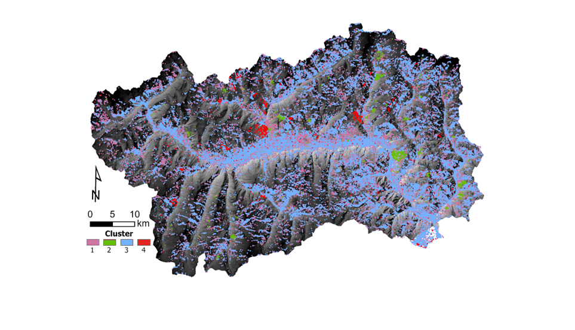
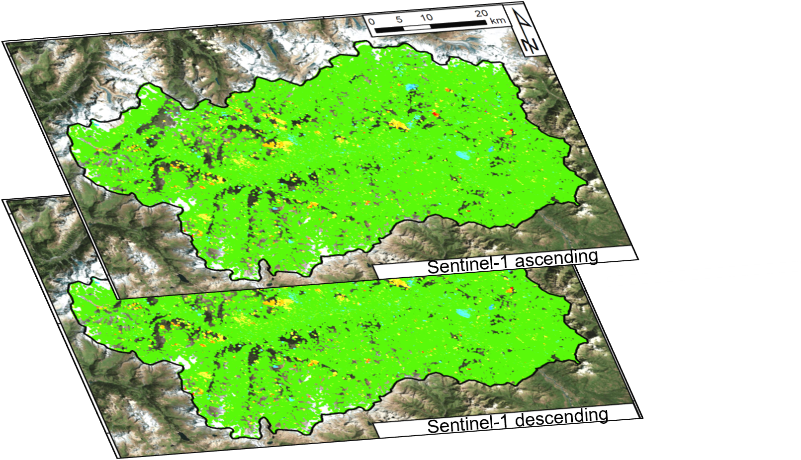
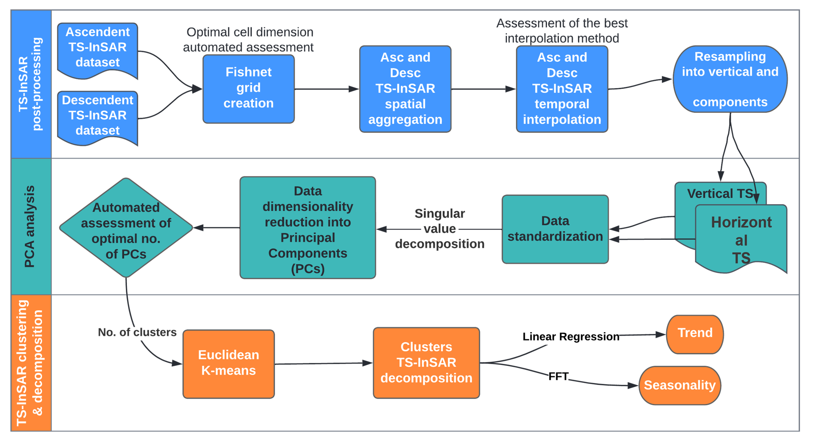

# InSAR-Time-Series-Clustering
First version of the code linked to the November submission to International Journal of Applied Earth Observation and Geoinformation.

Automated and unsupervised approach based on Principal Component Analysis (PCA), K-means clustering, Linear regression and Fast Fourier Transform to detect and analyze patterns of ground deformation from InSAR Time Series.

## Table of contents
- [Input Data](#input-data)
- [Rationale of procedure](#rationale-of-procedure)
- [Output](#output)
- [Acknowledgment](#acknowledgment)

## Input Data
Overlapping LOS InSAR Time Series from ascending and descending geometry of acquisition in CSV format.

## Rationale of procedure

(1) Spatial and temporal post-processing of the PSI dataset to retrieve newly interpolated vertical and horizontal displacement TS-InSAR; 2) PCA-based dimensionality reduction and features retrieval; 3) Unsupervised K-Means learning for TS-InSAR automated clustering and decomposition of the cluster centroids. 

## Acknowledgment
There is no restriction about the research/commercial/scientific use of this script. 
Please acknowledge the following work: 
Festa, D.
